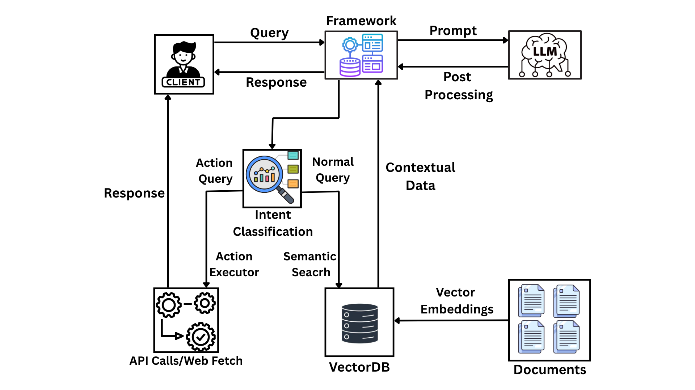

# **Domain-Specific RAG System – HackRx 4.0**

🚀 **An LLM-powered Retrieval-Augmented Generation system** designed to process large, domain-specific documents (Insurance, Legal, HR, Compliance) and answer natural language queries with accurate, explainable results.

---

## **📜 Features**

* **Multi-format Ingestion** – Supports PDF, DOCX, and Email formats.
* **Semantic Search** – Uses Pinecone vector embeddings for fast and relevant clause retrieval.
* **Low Latency Query Processing** – Gemini Flash LLM parses queries, identifies intent, and generates responses.
* **Explainable AI** – Provides answers with source references and rationale.
* **Modular & Scalable** – Easily extendable for new domains and document types.

---

## **🛠️ Tech Stack**

* **Backend:** FastAPI
* **LLM:** Gemini 2.5 Flash
* **Vector Store:** Pinecone
* **Embedding model:** llama-text-embed-v2
* **Database:** Pinecone Vector DB

---

## **⚙️ How It Works**

1. **Document Ingestion** – Parse, clean, and convert PDFs, DOCX, or emails into text.
2. **Chunking & Embedding** – Split text into semantic chunks and store embeddings in Pinecone.
3. **Query Processing** – User query sent to Gemini Flash LLM for intent extraction.
4. **Relevant Clause Retrieval** – Semantic search fetches closest document chunks.
5. **Response Generation** – Gemini Flash LLM produces answer with rationale and source links.

---

## 📊 Data Flow Diagram

<p align="center">
  
</p>


## **🚀 Getting Started**

### **1. Clone the repo**

```bash
git clone https://github.com/manask0412/code-crafters-hackrx-system.git
cd code-crafters-hackrx-system
```

### **2. Install dependencies**

```bash
pip install -r requirements.txt
```

### **3. Set environment variables**

Create a `.env` file:

```env
PINECONE_API_KEY=your_pinecone_key
PINECONE_INDEX_NAME=your_pinecone_index_name
API_AUTH_KEY=your_custom_api_auth_key
GOOGLE_API_KEY=your_google_api_key
DENSE_INDEX_HOST_URL=your_dense_index_host_url
```

### **4. Run the application**

```bash
uvicorn main:app --reload

```

---

## **📈 Future Enhancements**

* Multi-modal support (images, scanned docs).
* Real-time compliance gap detection.
* Multi-language document processing.
* Deployment-ready containerized version.

---

## **🏆 Achievements**

* 2nd Place – ML Hackathon, IIT Bhubaneswar (Deepfake Image Classifier).
* 2nd Place – AI Project Competition, BPUT Carnival (Crop Disease Detection).
